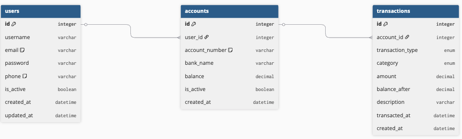

## ERD

---

## 테이블 설명

### USER
사용자 계정 정보를 저장하는 테이블입니다.

| 필드 | 타입 | 설명 |
|---|---|---|
| id | INT | PK |
| username | VARCHAR | 사용자 이름 |
| email | VARCHAR | 이메일 (로그인 ID, Unique) |
| password | VARCHAR | 비밀번호 |
| phone | VARCHAR | 전화번호 (Unique) |
| is_active | BOOLEAN | 활성화 여부 |
| created_at | DATETIME | 생성일시 |
| updated_at | DATETIME | 수정일시 |

### ACCOUNT
사용자가 보유한 계좌 정보를 저장하는 테이블입니다.

| 필드 | 타입 | 설명 |
|---|---|---|
| id | INT | PK |
| user_id | INT | FK (USER) |
| account_number | VARCHAR | 계좌번호 (Unique) |
| bank_name | VARCHAR | 은행명 |
| balance | DECIMAL | 잔액 |
| is_active | BOOLEAN | 활성화 여부 |
| created_at | DATETIME | 생성일시 |

### TRANSACTION
계좌별 거래 내역을 저장하는 테이블입니다.

| 필드 | 타입 | 설명 |
|---|---|---|
| id | INT | PK |
| account_id | INT | FK (ACCOUNT) |
| transaction_type | ENUM | 거래 유형 (입금/출금) |
| category | ENUM | 카테고리 (식비/교통비/고정비용/저축/생활비/문화생활/기타) |
| amount | DECIMAL | 거래 금액 |
| balance_after | DECIMAL | 거래 후 잔액 |
| description | VARCHAR | 거래 설명 |
| transacted_at | DATETIME | 거래 일시 |
| created_at | DATETIME | 생성일시 |

---

## 테이블 관계

| 관계 | 설명 |
|---|---|
| USER : ACCOUNT | 1:N — 한 사용자는 여러 계좌를 보유할 수 있다. |
| ACCOUNT : TRANSACTION | 1:N — 한 계좌에는 여러 거래 내역이 기록된다. |